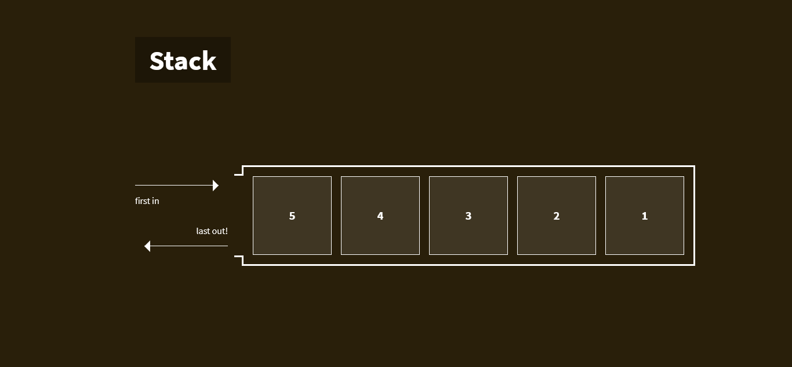

# Data Structures Visually

**The site is published to [GitHub Pages](https://martinheywang.github.io/data-structures-visually)!**

Take a look at an example ([direct link](https://martinheywang.github.io/data-structures-visually/pages/stack.html)):

As a self-taught developer, it is hard to get the motivation to learn data structures. So I had an idea : what if I could make learning them a project ? That's why I'm here creating graphical representation of common data structures.

I do like scratching my head on hard things, and that's a perfect idea for that. I love exploring complex CSS features & tricks (I'm even using Sass to add a layer of complexity!). I do find this project challenging.
